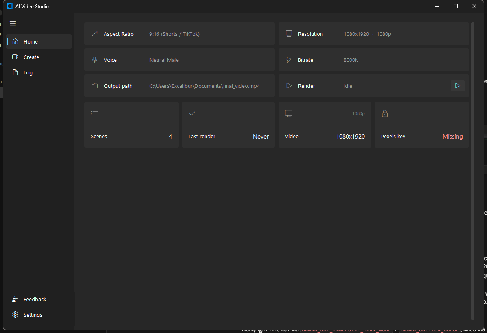
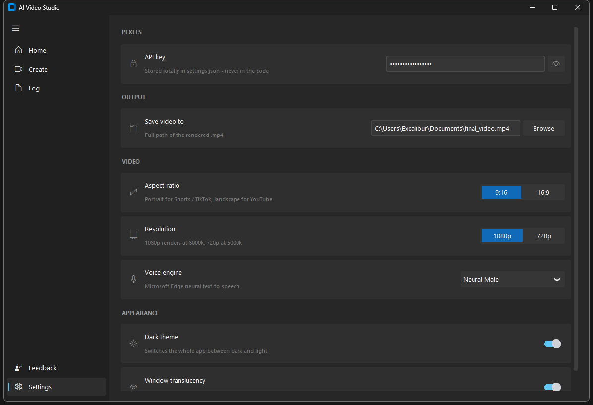
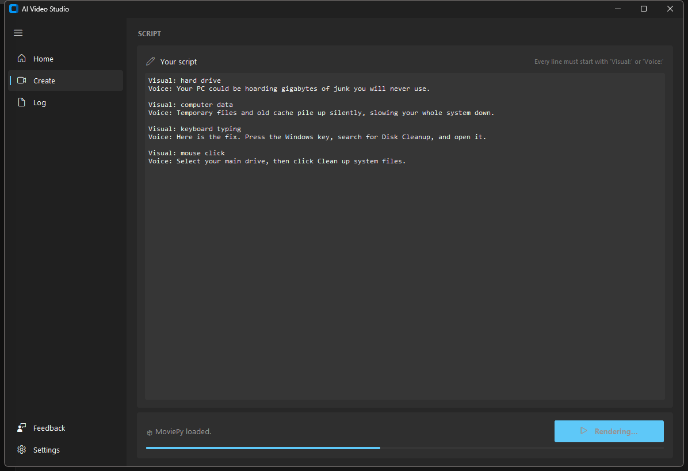
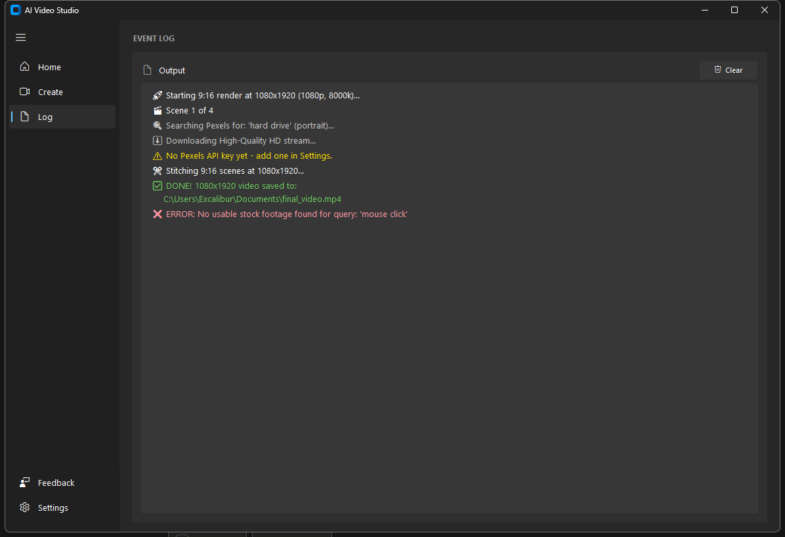

# AI Video Studio

A professional-grade automated video generation tool that turns written scripts
into fully edited, high-quality videos. Pick the visuals in words, write the
narration, and it fetches matching stock footage from Pexels, generates a neural
voiceover, and renders a 1080p or 720p MP4 in portrait or landscape.



## Features
- **Automated Stock Footage:** Automatically fetches relevant video clips from Pexels API.
- **Neural AI Voices:** Uses Microsoft Edge-TTS for high-quality, natural-sounding male and female voices.
- **Smart Script Parser:** Automatically reads your script line-by-line using `Visual:` and `Voice:` tags.
- **GUI Dashboard:** Windows 11 Fluent interface for API keys, voice selection, resolution and rendering status.
- **Portrait or landscape:** 9:16 for Shorts and TikTok, 16:9 for YouTube, at 1080p or 720p.
- **End-to-End Automation:** Fetches, generates, matches duration, and stitches everything into a final `.mp4`.

## Download

Get the latest [release](../../releases/latest):

| | |
|---|---|
| **`AIVideoStudio-x.y.z-setup.exe`** | Normal install. Adds a Start menu entry and an uninstaller. Installs for your user only, so it never asks for administrator rights. |
| **`AIVideoStudio-x.y.z-portable.zip`** | No install. Unzip anywhere and run `AIVideoStudio.exe`. |

**No Python, no pip, no separate FFmpeg install** — everything is in the download.
(Running from source still needs all three; see below.)

### Windows will warn you the first time

These builds are not code-signed, because a signing certificate costs several
hundred dollars a year. SmartScreen will show **"Windows protected your PC"**,
where the only obvious button is *Don't run*. Click **More info** → **Run anyway**.

You can confirm you have the real file by checking its hash against
`SHA256SUMS.txt` on the release page:

```powershell
Get-FileHash .\AIVideoStudio-3.1.0-setup.exe -Algorithm SHA256
```

## First run

The app needs a **free Pexels API key** to find stock footage. Get it at
[pexels.com/api](https://www.pexels.com/api/), then paste it into
**Settings → Pexels API key**.

A **Pixabay key** is optional: when Pexels has nothing good for a search, the app
tries Pixabay too. Get one at [pixabay.com/api/docs](https://pixabay.com/api/docs/)
and paste it into **Settings → Pixabay API key**. Scripts that only use your own
files (see `local:` below) need no key at all.

Keys are stored in plain text in `%APPDATA%\AIVideoStudio\settings.json`.



## Writing a script

Every line starts with `Visual:` or `Voice:`, in pairs. `Visual:` is the Pexels
search; `Voice:` is what gets spoken over it. One pair is one scene.

```
Visual: frustrated person typing laptop
Voice: Did you know you are copying and pasting completely wrong on Windows?

Visual: hands on glowing keyboard
Voice: Press the Windows key and the letter V to unlock your clipboard history.
```

See [example_script.txt](example_script.txt) for a full worked example.

### Optional per-scene settings

Any scene can add these lines after its `Visual:`, in any order. Scripts without
them work exactly as before.

```
Visual: hard drive
Voice: Your PC is hoarding gigabytes of junk.
Duration: auto
Zoom: in

Visual: local:C:/Users/me/recordings/taskmgr.mp4
Voice: Here is the fix. Open Task Manager.
Duration: 4s
```

| Line | Values | If left out |
|---|---|---|
| `Duration:` | `auto`, or seconds like `4.5s`. A set duration is exact — a longer voice line is cut short, with a warning in the log. | `auto`: the scene lasts as long as its voice line, plus padding |
| `Padding:` | seconds like `0.5s` of pause after the voice line (ignored when `Duration:` is set) | the **Scene padding** setting |
| `Zoom:` | `in`, `out`, or `none` — a slow 1.0× → 1.1× Ken Burns zoom | a subtle zoom, stronger on photos and still footage |

A scene with no `Voice:` line is a silent shot and needs a `Duration:`, e.g. a
logo held for `Duration: 2s`.

When a voice line runs longer than 6 seconds and has no set duration, the scene
cuts between **two different clips** halfway through, to keep the pace up.
Scenes join with a short 0.3 s crossfade.

### Your own footage and images

Start a `Visual:` with `local:` to use a file instead of stock footage — a screen
recording, your own b-roll, a screenshot or a photo:

```
Visual: local:C:/Users/me/Videos/demo.mp4
Visual: local:screenshots/settings.png
```

Videos: `.mp4 .mov .mkv .webm .avi .m4v` (their own sound is dropped).
Images: `.png .jpg .jpeg .webp .bmp`. A relative path is looked up in the folder
the video is being saved to. Every `local:` file is checked before anything is
downloaded, so a typo fails straight away.

### Background music

Turn on **Settings → Background music** and pick a track. It plays at about 25%
volume in the pauses and dips to about 9% whenever the voice is speaking, easing
down just before each line and back up after. Drop tracks into
`Documents\AI Video Studio\Music` (**Open folder**), or **Browse** for any audio
file.

### Footage credits

Next to each video the app writes `<name>.credits.txt`, listing the Pexels or
Pixabay creator and page for every stock clip used — handy for a YouTube
description.



## Options

| Setting | Choices |
|---|---|
| Aspect ratio | `9:16` for Shorts / TikTok / Reels, `16:9` for YouTube |
| Resolution | `1080p` (8000k bitrate) or `720p` (5000k) |
| Scene padding | `0s`, `0.25s` (default), `0.5s` or `1s` of pause after each voice line |
| Voice | Four Microsoft Edge neural voices, male and female |
| Background music | On or off, with any track; ducks under the voice automatically |
| Theme | Dark or light, with a Mica backdrop on Windows 11 |

Output size follows both settings: 9:16 at 1080p is 1080×1920, 16:9 at 720p is
1280×720, and so on.

## Where things go

| | |
|---|---|
| Settings | `%APPDATA%\AIVideoStudio\settings.json` |
| Rendered video | Your Videos folder by default; change it in Settings |
| Footage credits | `<video name>.credits.txt`, next to the video |
| Your music | `Documents\AI Video Studio\Music` |
| Search cache | `%APPDATA%\AIVideoStudio\cache`, kept for 24 hours (Pixabay's terms require it) |
| Temporary clips | `%TEMP%\AIVideoStudio`, deleted after each render |

## Needs an internet connection

Stock footage (Pexels, Pixabay) and the voiceover (Microsoft Edge's online
text-to-speech) come from the network. Your own `local:` files and the rendering
are local.

## AI Script Generation Prompt

You can use ChatGPT, Claude, or Gemini to automatically write scripts formatted specifically for this app. Copy and paste the prompt template below into your AI of choice:

---

> **Prompt:**
>
> "You are an expert short-form video scriptwriter for TikTok and YouTube Shorts.
>
> I need a 45-second high-retention script about: **[INSERT TOPIC HERE]**
>
> Strict Formatting Rules:
> 1. Output ONLY pairs of lines starting with `Visual:` and `Voice:`.
> 2. Do NOT include scene numbers, timestamps, markdown asterisks, or extra conversational text.
> 3. `Visual:` must contain 2 to 4 simple, searchable stock video keywords that can be found on Pexels (e.g., 'typing on laptop keyboard', 'neon lightning bolt', 'frustrated person at computer').
> 4. `Voice:` must contain punchy, engaging spoken dialogue (no emojis, no stage directions).
> 5. Create 6 to 8 scene pairs (roughly 100-120 words total).
>
> Example output format:
> Visual: slow broken laptop
> Voice: Is your computer taking forever to start up?
>
> Visual: hands typing on keyboard
> Voice: Here is a simple setting tweak to fix it in seconds."

---

### How to use:
1. Replace `[INSERT TOPIC HERE]` with your video idea (e.g., *'3 hidden iPhone camera features'* or *'How to clear cache on Windows'*).
2. Copy the AI's exact text output.
3. Paste it directly into the **Create** page script box and click **Render Video**!

## Run from source

Needs **Python 3.10+**. FFmpeg comes from `imageio-ffmpeg`, so you do not need to
install it separately or add it to PATH.

```bash
git clone https://github.com/bodrumundenizi-beep/free-ai-video-generator.git
cd free-ai-video-generator
pip install -r requirements.txt
python src/ai_video_studio.py
```

## Build the installer yourself

```bash
pip install -r requirements.txt -r requirements-build.txt
python -m pytest
python packaging/make_icon.py
pyinstaller --noconfirm --clean packaging/ai_video_studio.spec
"C:\Program Files (x86)\Inno Setup 6\ISCC.exe" /DMyAppVersion=3.1.0 packaging\installer.iss
```

Releases are built automatically by GitHub Actions when a `v*` tag is pushed.



## Licence

MIT — see [LICENSE](LICENSE).

The released builds redistribute several third-party components under their own
licences, including an LGPL library and a GPL FFmpeg binary. See
[THIRD-PARTY-LICENSES.md](THIRD-PARTY-LICENSES.md).
