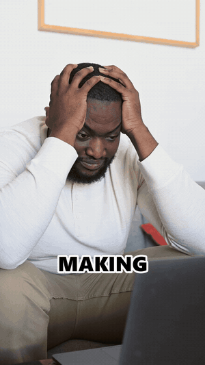
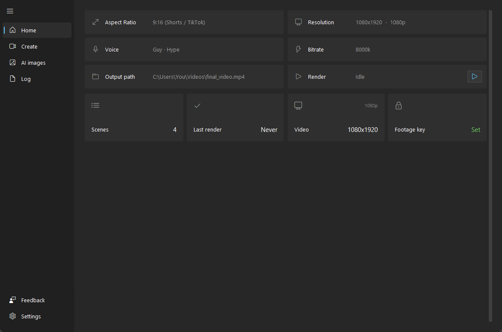
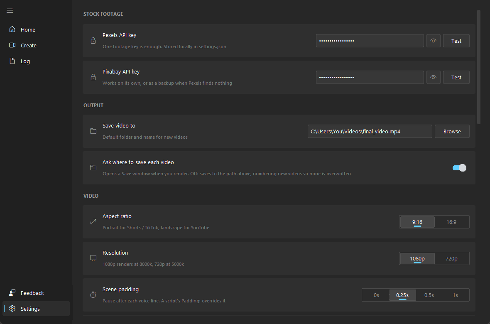
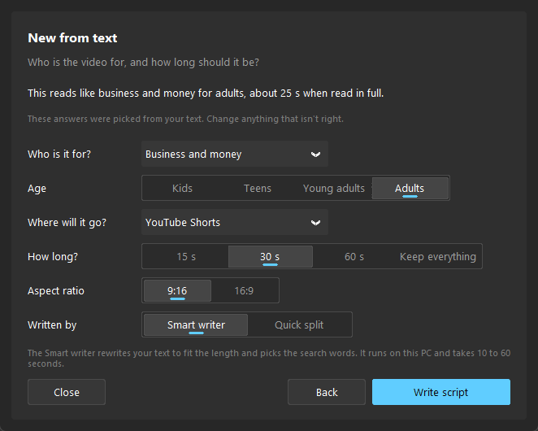
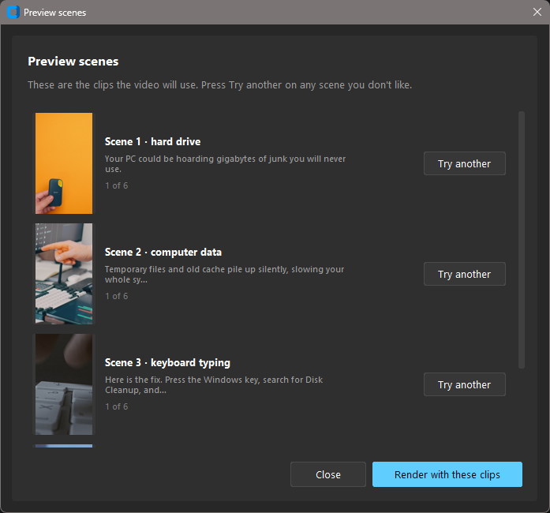
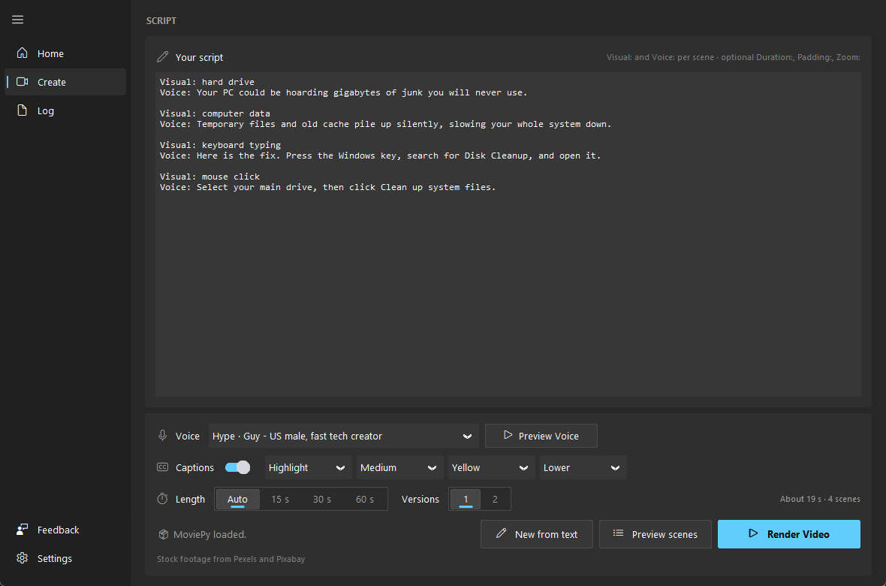
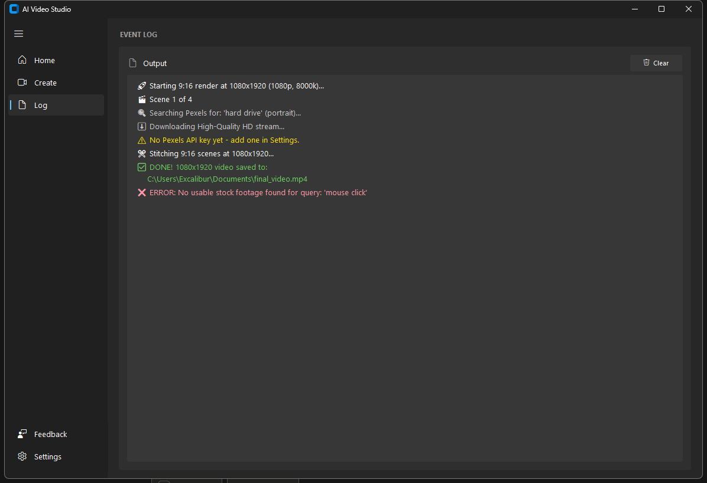

# AI Video Studio

A professional-grade automated video generation tool that turns written scripts
into fully edited, high-quality videos. Pick the visuals in words, write the
narration, and it fetches matching stock footage from Pexels, generates a neural
voiceover, and renders a 1080p or 720p MP4 in portrait or landscape.

<p align="center">
  <br>
  <em>Made from a six-scene script: footage, voice and captions are automatic.</em>
</p>



## Features
- **Paste any text, get a script:** Paste plain text, say who the video is for and how long it should be, and a built-in open-source AI writes the script. It runs on your PC: no account, no key, nothing sent anywhere.
- **Automated Stock Footage:** Automatically fetches relevant video clips from Pexels or Pixabay.
- **Preview and choose your clips:** See the clip picked for each scene before rendering, and swap any you don't like with one click.
- **Two versions in one go:** Optionally render the same script twice with different clips, and keep the better one.
- **Pick a length:** Fit the video to 15, 30 or 60 seconds, with a live estimate as you type.
- **Neural AI Voices:** Uses Microsoft Edge-TTS for high-quality, natural-sounding male and female voices.
- **Smart Script Parser:** Automatically reads your script line-by-line using `Visual:` and `Voice:` tags.
- **Windows 11 Fluent interface:** Settings-app style segmented controls, smooth page transitions, dark and light themes with Mica, and live render progress.
- **Auto-captions:** The spoken words are burned into the video, a few at a time, with the word being said highlighted. An `.srt` subtitle file is saved too.
- **Watch it straight away:** When a render finishes, the video plays inside the app, with sound.
- **Portrait or landscape:** 9:16 for Shorts and TikTok, 16:9 for YouTube, at 1080p or 720p.
- **End-to-End Automation:** Fetches, generates, matches duration, and stitches everything into a final `.mp4`.

## Download

Get the latest [release](../../releases/latest):

| | |
|---|---|
| **`AIVideoStudio-x.y.z-setup.exe`** | Normal install. Adds a Start menu entry and an uninstaller. Installs for your user only, so it never asks for administrator rights. |
| **`AIVideoStudio-x.y.z-portable.zip`** | No install. Unzip anywhere and run `AIVideoStudio.exe`. |

**No Python, no pip, no separate FFmpeg install** — everything is in the download.

**Updating:** the app tells you when a newer version is out. If you used the
installer, press **Update now**: the app downloads the new version, checks it,
installs it over the old one and reopens. The portable version links to the
download instead. Either way your settings, API keys and the Smart writer are kept.
(Running from source still needs all three; see below.)

**The Smart writer is a separate 2.5 GB download.** The installer fetches it during setup; the portable version fetches it the first time you use **New from text**. It is downloaded once and kept when you update the app. See [New from text](#new-from-text) below.

### Windows will warn you the first time

These builds are not code-signed, because a signing certificate costs several
hundred dollars a year. SmartScreen will show **"Windows protected your PC"**,
where the only obvious button is *Don't run*. Click **More info** → **Run anyway**.

You can confirm you have the real file by checking its hash against
`SHA256SUMS.txt` on the release page:

```powershell
Get-FileHash .\AIVideoStudio-3.7.1-setup.exe -Algorithm SHA256
```

## First run

The app needs **one free stock footage key**, from either
[Pixabay](https://pixabay.com/api/docs/) or [Pexels](https://www.pexels.com/api/).
Neither is required: one of the two is enough. The first time you open the app,
a **Welcome** window walks you through it: choose Pixabay or Pexels, open its
page, copy your key, paste it in, and press **Test key** to check it works. You
can reopen the window later from **Feedback → Setup guide**, or paste a key into
**Settings**.

With both keys set, the app searches Pexels first and falls back to Pixabay when
Pexels has nothing good. Scripts that only use your own files (see `local:`
below) need no key at all.

Keys are stored in plain text in `%APPDATA%\AIVideoStudio\settings.json`.



## New from text

You don't have to write the script format by hand. Press **New from text** on the
Create page:

1. **Paste your text** and press **Analyse**. Any plain text works: notes, an
   article, a list.
2. **Check the answers.** The app reads the text and picks who the video is for
   (what it is about, the age group), how long it should be and its shape. You
   also choose where it will be posted. Change anything that isn't right.
3. **Write script.** Read the result, press **Write again** if you want a
   different version, then **Use this script** to put it in the editor.



There are two writers:

| | Smart writer | Quick split |
|---|---|---|
| What it does | Rewrites and shortens your text to fit the length, opens with a hook, and picks search words for each scene | Keeps your words exactly as written, splits them into scenes, and guesses search words from each sentence |
| Speed | About 10 to 60 seconds | Instant |
| Needs | A one-time 2.5 GB download and about 8 GB of RAM | Nothing |

If a text is too long for the length you chose, the Smart writer shortens it.
Quick split leaves out the least important sentences, lists them with a **Put
back** button, and offers the shortest length that keeps everything.

What the audience changes: the voice, the speaking pace and how short the scenes
are. The Smart writer is also told who it is writing for, but expect the wording
to change only a little between audiences.

### About the Smart writer

The Smart writer is [Qwen3 4B](https://huggingface.co/Qwen/Qwen3-4B-GGUF), an
open-source language model (Apache 2.0 licence), run on your PC by
[llama.cpp](https://github.com/ggml-org/llama.cpp) (MIT licence).

- **Private:** your text never leaves your computer. No account and no key.
- **One download:** 2.5 GB, saved in `%LOCALAPPDATA%\AIVideoStudio\models`. A
  cancelled download carries on from where it stopped. **Settings → Smart
  writer** shows its state and can download or repair it.
- **Memory:** it uses about 5 GB while it writes and gives it back straight
  after. If the PC is short of memory, too slow, or anything else goes wrong, the
  app uses Quick split and tells you why.
- **Graphics card:** turn on **Settings → Use the graphics card** to run it on a
  dedicated NVIDIA, AMD or Intel card instead of the processor. On an RTX 4060 a
  script takes about 3 seconds instead of about 20. It is off by default, needs
  about 3 GB of video memory, and goes back to the processor by itself if the
  card can't be used.
- **It can be wrong.** It is a small model. Read the script before you render:
  it sometimes changes a detail, such as "every workday" becoming "every day".

## Writing a script

Every line starts with `Visual:` or `Voice:`, in pairs. `Visual:` is the Pexels
search; `Voice:` is what gets spoken over it. One pair is one scene.

```
Visual: frustrated person typing laptop
Voice: Did you know you are copying and pasting completely wrong on Windows?

Visual: hands on glowing keyboard
Voice: Press the Windows key and the letter V to unlock your clipboard history.
```

See [example_script.txt](example_script.txt) for a full worked example.

### Optional per-scene settings

Any scene can add these lines after its `Visual:`, in any order. Scripts without
them work exactly as before.

```
Visual: hard drive
Voice: Your PC is hoarding gigabytes of junk.
Duration: auto
Zoom: in

Visual: local:C:/Users/me/recordings/taskmgr.mp4
Voice: Here is the fix. Open Task Manager.
Duration: 4s
```

| Line | Values | If left out |
|---|---|---|
| `Duration:` | `auto`, or seconds like `4.5s`. A set duration is exact — a longer voice line is cut short, with a warning in the log. | `auto`: the scene lasts as long as its voice line, plus padding |
| `Padding:` | seconds like `0.5s` of pause after the voice line (ignored when `Duration:` is set) | the **Scene padding** setting |
| `Zoom:` | `in`, `out`, or `none` — a slow 1.0× → 1.1× Ken Burns zoom | a subtle zoom, stronger on photos and still footage |

A scene with no `Voice:` line is a silent shot and needs a `Duration:`, e.g. a
logo held for `Duration: 2s`.

When a voice line runs longer than 6 seconds and has no set duration, the scene
cuts between **two different clips** halfway through, to keep the pace up.
Scenes join with a short 0.3 s crossfade.

### Your own footage and images

Start a `Visual:` with `local:` to use a file instead of stock footage — a screen
recording, your own b-roll, a screenshot or a photo:

```
Visual: local:C:/Users/me/Videos/demo.mp4
Visual: local:screenshots/settings.png
```

Videos: `.mp4 .mov .mkv .webm .avi .m4v` (their own sound is dropped).
Images: `.png .jpg .jpeg .webp .bmp`. A relative path is looked up in the folder
the video is being saved to. Every `local:` file is checked before anything is
downloaded, so a typo fails straight away.

### Background music

Turn on **Settings → Background music** and pick a track. It plays at about 25%
volume in the pauses and dips to about 9% whenever the voice is speaking, easing
down just before each line and back up after. Drop tracks into
`Documents\AI Video Studio\Music` (**Open folder**), or **Browse** for any audio
file.

### Voices

Pick a voice on the **Create** page and press **▶ Preview Voice** to hear it
before rendering. All voices are free — no account or key needed.

| Group | Voices | Delivery |
|---|---|---|
| Tech / Short-Form Hype | Guy, Jenny, Steffan (US) | a bit faster and brighter, short pauses |
| Deep / Storyteller | Christopher, Eric, Roger (US) | a bit slower and lower, longer pauses |
| Professional / Tutorial | Aria, Andrew, Ava (US) | clear, even pace |
| Accents & Regional | Ryan, Sonia (UK), William (Australia) | natural pace |
| Classic (low quality) | the four voices from earlier versions | read exactly as before, no studio processing |

The first four groups get **studio processing**: natural breath pauses at
commas and full stops, then broadcast mastering — low-end warmth, compression
so every word is audible, and loudness set to −14 LUFS, the level YouTube
Shorts, Reels and TikTok play at.

### Choosing your clips

Press **Preview scenes** on the Create page to see the clip the app picked for
each scene, next to the line spoken over it. **Try another** steps through up to
six clips for that scene. When they all look right, press **Render with these
clips**. If you close the window instead, **Render Video** still uses your
choices, until you edit the script.

A long voice line uses two clips: the preview chooses the first, and the second
is the next clip in the list.



### Two versions

Set **Versions** to `2` and the app renders the script twice: the same voice and
captions, different clips in every stock scene. They are saved as `name.mp4` and
`name (version 2).mp4`, each with its own subtitles and credits file, and the
Render complete window lets you play both. The voice is made once, so two
versions take well under twice as long as one.

### Video length

The Create page shows about how long your script will be, and updates as you
type. It is an estimate: the voice paces every line a little differently.

Set **Length** to `15 s`, `30 s` or `60 s` to fit the video to that length. The
app adjusts the pauses between scenes first. If that is not enough, it speeds
the voice up or slows it down by at most 15%, keeping its pitch, and the
captions follow. A script that is far too long or too short is rendered as
close as it gets, and the Log tells you roughly how many words to cut or add.
Scenes with their own `Duration:` or `Padding:` line are left exactly as written.

### Stopping a render

While a video is rendering, the Render button becomes **Cancel**. The render
stops within a second or two and leaves no unfinished file behind.

### Captions

Captions are on by default: the words appear on screen as they are spoken, timed
from the voice itself, so they stay in sync without any setup. Change how they
look, or turn them off, in the **Captions** row on the Create page or under
**Settings → Captions**. Scenes without a `Voice:`
line have no captions.

The `.srt` file saved next to the video can be uploaded to YouTube as real
subtitles (**Subtitles → Upload file → With timing**).

### Footage credits

Next to each video the app writes `<name>.credits.txt`, listing the Pexels or
Pixabay creator and page for every stock clip used — handy for a YouTube
description.



## Options

| Setting | Choices |
|---|---|
| Aspect ratio | `9:16` for Shorts / TikTok / Reels, `16:9` for YouTube |
| Resolution | `1080p` (8000k bitrate) or `720p` (5000k) |
| Scene padding | `0s`, `0.25s` (default), `0.5s` or `1s` of pause after each voice line |
| Voice | 16 free Microsoft Edge neural voices — see **Voices** below |
| Length | `Auto` (default), or fit to `15 s`, `30 s` or `60 s` — see **Video length** below |
| Versions | `1` (default) or `2`: the same video twice, with different clips |
| Saving | **Ask where to save each video** (default): a Save window opens for every render, like a browser download. Off: videos go to the default path and are numbered `name (2).mp4`, `name (3).mp4`… so none is overwritten |
| Captions | On or off. Style: `Highlight`, `One word` or `Plain`. Size: `Small`, `Medium`, `Large`. Highlight: yellow, green, cyan, pink, white or black. Position: `Lower`, `Center` or `Top` |
| Background music | On or off, with any track; ducks under the voice automatically |
| Theme | Dark or light, with a Mica backdrop on Windows 11 |

Output size follows both settings: 9:16 at 1080p is 1080×1920, 16:9 at 720p is
1280×720, and so on.

## Where things go

| | |
|---|---|
| Settings | `%APPDATA%\AIVideoStudio\settings.json` |
| Rendered video | Wherever you choose in the Save window; it opens in your Videos folder the first time. An existing video is only replaced if you confirm it |
| Footage credits | `<video name>.credits.txt`, next to the video |
| Subtitles | `<video name>.srt`, next to the video (when captions are on) |
| Your music | `Documents\AI Video Studio\Music` |
| Log file | `%APPDATA%\AIVideoStudio\logs\app.log`. It stays on your PC |
| Search cache | `%APPDATA%\AIVideoStudio\cache`, kept for 24 hours (Pixabay's terms require it) |
| Temporary clips | `%TEMP%\AIVideoStudio`, deleted after each render |

## If the video can't be saved

If the folder you chose refuses the file, the app does not lose the render. It
saves the video to your Videos folder, then Desktop, then Downloads, then a temp
folder, and the Log says which one it used.

The usual cause on school and work PCs is Windows **Controlled folder access**
(ransomware protection), which blocks unknown programs from writing to Videos,
Documents and Desktop, and makes Save windows answer "file not found". Saving to
Downloads or another folder works, or an administrator can allow the app under
**Windows Security → Virus & threat protection → Ransomware protection**.

## Reporting a problem

When a render fails, the error window has a **Report this** button, and
**Feedback → Report a problem** works at any time. Both open a report you can
read and edit before anything happens: the app version, your Windows version,
a few settings, the error, and the last lines of the log. API keys, your Windows
user name and the spoken lines of your script are removed first.

Nothing is sent by the app. **Open GitHub issue** opens a prefilled issue in
your browser for you to submit, and **Copy to clipboard** lets you paste the
report anywhere else.

## Needs an internet connection

Stock footage (Pexels, Pixabay) and the voiceover (Microsoft Edge's online
text-to-speech) come from the network. Your own `local:` files, the rendering and
the Smart writer are local; the Smart writer only needs the internet once, for its
download.

## AI Script Generation Prompt

You can use ChatGPT, Claude, or Gemini to automatically write scripts formatted specifically for this app. Copy and paste the prompt template below into your AI of choice:

---

> **Prompt:**
>
> "You are an expert short-form video scriptwriter for TikTok and YouTube Shorts.
>
> I need a 45-second high-retention script about: **[INSERT TOPIC HERE]**
>
> Strict Formatting Rules:
> 1. Output ONLY pairs of lines starting with `Visual:` and `Voice:`.
> 2. Do NOT include scene numbers, timestamps, markdown asterisks, or extra conversational text.
> 3. `Visual:` must contain 2 to 4 simple, searchable stock video keywords that can be found on Pexels (e.g., 'typing on laptop keyboard', 'neon lightning bolt', 'frustrated person at computer').
> 4. `Voice:` must contain punchy, engaging spoken dialogue (no emojis, no stage directions).
> 5. Create 6 to 8 scene pairs (roughly 100-120 words total).
>
> Example output format:
> Visual: slow broken laptop
> Voice: Is your computer taking forever to start up?
>
> Visual: hands typing on keyboard
> Voice: Here is a simple setting tweak to fix it in seconds."

---

### How to use:
1. Replace `[INSERT TOPIC HERE]` with your video idea (e.g., *'3 hidden iPhone camera features'* or *'How to clear cache on Windows'*).
2. Copy the AI's exact text output.
3. Paste it directly into the **Create** page script box and click **Render Video**!

## Run from source

Needs **Python 3.10+**. FFmpeg comes from `imageio-ffmpeg`, so you do not need to
install it separately or add it to PATH.

```bash
git clone https://github.com/bodrumundenizi-beep/free-ai-video-generator.git
cd free-ai-video-generator
pip install -r requirements.txt
python src/ai_video_studio.py
```

The Smart writer also needs llama.cpp, the program that runs its model. This
fetches the pinned, checksum-verified Windows build into `vendor/llama/`:

```bash
python packaging/fetch_llama.py
```

Without it the app still runs and uses Quick split.

## Build the installer yourself

```bash
pip install -r requirements.txt -r requirements-build.txt
python -m pytest
python packaging/make_icon.py
python packaging/fetch_llama.py
pyinstaller --noconfirm --clean packaging/ai_video_studio.spec
"C:\Program Files (x86)\Inno Setup 6\ISCC.exe" /DMyAppVersion=3.7.1 packaging\installer.iss
```

Releases are built automatically by GitHub Actions when a `v*` tag is pushed.



## Code signing policy

The Windows builds are **not code-signed**, so Windows shows a SmartScreen
warning the first time you run them (see [Download](#download) for how to get
past it and how to check the file's SHA-256 hash). Signing is planned once the
project is established enough to qualify for an open-source signing programme.

- **Builds:** every release is built from this repository by GitHub Actions
  ([release workflow](.github/workflows/release.yml)); nothing is built or
  uploaded by hand.
- **Committers, reviewers and approvers:** the repository owner,
  [@bodrumundenizi-beep](https://github.com/bodrumundenizi-beep).

### Privacy

This program does not collect or send any personal data. It connects to other
systems only to do what you ask of it: Pexels and Pixabay to search for and
download stock footage (using your own API keys), and Microsoft Edge's online
text-to-speech to generate the voiceover from your script text. On startup it
also asks GitHub for this project's latest version number, to tell you about
updates; that request contains nothing about you, and you can turn it off under
**Settings → Updates**. An update is only downloaded when you press **Update
now**; it comes from this project's GitHub releases and is checked against the
SHA-256 published with the release before it is run. Settings and API keys stay
on your computer.

The Smart writer runs entirely on your computer. Text you paste into **New from
text** is not sent anywhere. The only connection it makes is the one-time
download of the model file from Hugging Face.

The app keeps a log file on your PC to help with problems. It is never sent
anywhere by the app; a problem report quotes from it only when you choose to
send one, and you see the text first.

## Licence

MIT — see [LICENSE](LICENSE).

The released builds redistribute several third-party components under their own
licences, including an LGPL library and a GPL FFmpeg binary. See
[THIRD-PARTY-LICENSES.md](THIRD-PARTY-LICENSES.md).
